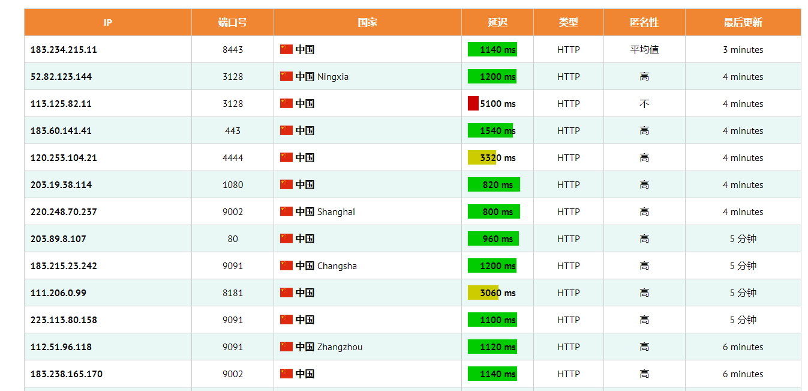

# 功能介绍 ：完全基于jdk封装
1. GET请求,不带参数

2. proxy 代理,支持HTTP/HTTPS/FTP,SOCKET4/SOCKET5

3. 代理测试 [代理ip获取](https://fineproxy.org/cn/free-proxies/asia/china/)

--- 
用代理
{"status":"success","country":"China","countryCode":"CN","region":"GD","regionName":"Guangdong","city":"Shenzhen","zip":"518000","lat":22.5429,"lon":114.06,"timezone":"Asia/Shanghai","isp":"China Mobile Communications Corporation","org":"China Mobile Communications Corporation","as":"AS56040 China Mobile communications corporation","query":"183.234.214.114"}
不用代理
{"status":"success","country":"China","countryCode":"CN","region":"HA","regionName":"Henan","city":"Zhengzhou","zip":"","lat":34.7599,"lon":113.6459,"timezone":"Asia/Shanghai","isp":"China Mobile","org":"China Mobile","as":"AS24445 Henan Mobile Communications Co.,Ltd","query":"39.162.81.172"}
---
